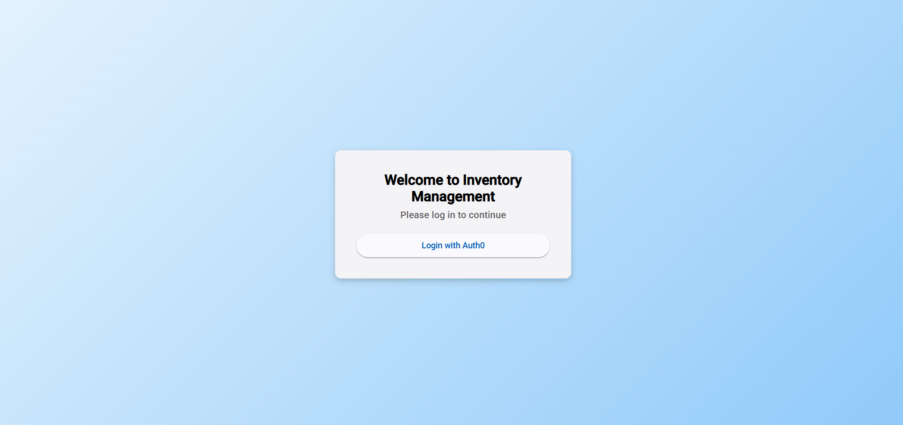

```markdown
# Inventory Management System

Welcome to the Inventory Management System repository! This project consists of a frontend Angular application and a backend .NET Web API. The system uses Auth0 for user authentication and provides full inventory CRUD operations.

## Directory Structure

```
InventoryManagementSystem/
├── backend-inventory-manage-system/   # .NET 8.0 Web API backend (runs on port 3010)
├── frontend-inventory-manage-system/    # Angular frontend
├── .gitignore
└── LoginScreen.png                      # Screenshot of the login screen
```

## Features

- **User Authentication:**  
  Uses Auth0 for secure user authentication.
  
- **Inventory CRUD:**  
  Manage inventory items with full Create, Read, Update, and Delete functionality.
  
- **Responsive Design:**  
  Frontend built with Angular for a responsive and interactive UI.

## Prerequisites

- [.NET 8.0 SDK](https://dotnet.microsoft.com/download)
- [Node.js and npm](https://nodejs.org/)
- [Angular CLI](https://angular.io/cli)
- [Auth0 Account](https://auth0.com/)

## Getting Started

### Backend (.NET 8.0)

1. Navigate to the backend folder:

    ```bash
    cd backend-inventory-manage-system
    ```

2. Restore packages and build the project:

    ```bash
    dotnet restore
    dotnet build
    ```

3. Run the backend application (which listens on port 3010):

    ```bash
    dotnet run
    ```

The backend Web API will now be running at `https://localhost:3010` (or `http://localhost:3010` depending on your configuration).

### Frontend (Angular)

1. Navigate to the frontend folder:

    ```bash
    cd frontend-inventory-manage-system
    ```

2. Install dependencies:

    ```bash
    npm install
    ```

3. Run the Angular application:

    ```bash
    ng serve
    ```

The Angular application will be available at `http://localhost:4200`.

### Auth0 Configuration

Make sure to configure your Auth0 settings for both the backend and frontend:

- **Frontend:** Update the Auth0 client settings (domain, clientId, etc.) in your Angular configuration files.
- **Backend:** Ensure that the Auth0 settings (e.g., Authority, Audience) are properly set in your backend configuration (e.g., in `appsettings.json` or environment variables).

## API Testing

You can test the API endpoints using `curl`. For example, to fetch inventory items (using an Auth0 bearer token):

```bash
curl -X GET "https://localhost:3010/api/inventory" \
     -H "Authorization: Bearer YOUR_AUTH0_TOKEN"
```

Replace `YOUR_AUTH0_TOKEN` with your actual token.

## Login Screen Screenshot

Below is a screenshot of the login screen:



## License

This project is licensed under the MIT License. See the [LICENSE](LICENSE) file for details.

## Contributing

Contributions are welcome! Please open an issue or submit a pull request if you'd like to help improve the project.
```